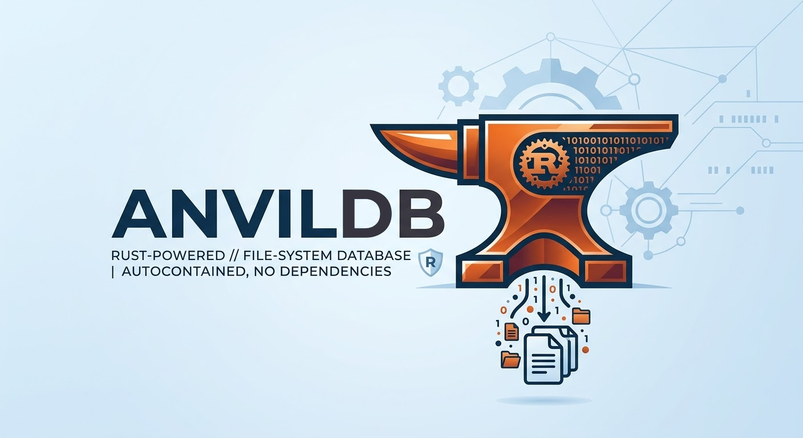

<p align="center">
  
</p>

<p align="center"><strong>High-performance embedded JSON database for PHP.</strong></p>

<p align="center">Zero-config, schema-optional, powered by a native Rust engine via FFI.</p>

---

## Requirements

- PHP >= 8.1 with FFI extension enabled (`ffi.enable=true` in php.ini)

## Installation

Add the repository and require the package in your `composer.json`:

```json
{
    "repositories": [
        {
            "type": "vcs",
            "url": "https://github.com/kevinsillo/anvildb-php"
        }
    ],
    "require": {
        "kevinsillo/anvildb": "v0.5.0"
    }
}
```

Then run:

```bash
composer update
```

The package includes precompiled binaries for all supported platforms. No Rust toolchain needed.

## Quick Start

```php
<?php

use AnvilDb\AnvilDb;

$db = new AnvilDb(__DIR__ . '/data');

$db->createCollection('users');
$users = $db->collection('users');

// Insert — returns document with auto-generated UUID
$user = $users->insert(['name' => 'Kevin', 'role' => 'admin', 'age' => 30]);

// Find, update, delete
$found = $users->find($user['id']);
$users->update($user['id'], ['name' => 'Kevin', 'role' => 'admin', 'age' => 31]);
$users->delete($user['id']);

$db->close();
```

## Queries

```php
$results = $db->collection('users')
    ->where('role', '=', 'admin')
    ->where('age', '>', 25)
    ->orderBy('name', 'asc')
    ->limit(10)
    ->get();
```

Operators: `=`, `!=`, `>`, `<`, `>=`, `<=`, `contains`, `between`, `in`, `not_in`.

```php
->whereBetween('price', 10, 100)
->whereIn('status', ['active', 'pending'])
->whereNotIn('role', ['banned'])
```

## Joins

```php
$results = $db->collection('orders')
    ->join('users', 'user_id', 'id', 'inner', 'user_')
    ->where('user_name', '=', 'Alice')
    ->orderBy('total', 'desc')
    ->get();

// LEFT JOIN
$results = $db->collection('users')
    ->leftJoin('orders', 'id', 'user_id', 'order_')
    ->get();
```

## Aggregations

```php
$db->collection('orders')->sum('total')->avg('total')->get();

$db->collection('orders')
    ->groupBy('category', [
        ['function' => 'count', 'alias' => 'total'],
        ['function' => 'sum', 'field' => 'price', 'alias' => 'revenue'],
    ])->get();
```

## Indexes

```php
$collection->createIndex('email', 'unique');
$collection->createIndex('age', 'range');
$collection->createIndex('status', 'hash');
```

## Schema Validation

```php
$collection->setSchema([
    'name' => 'string',
    'age' => 'int',
    'active' => 'bool',
]);
```

## Write Buffering

```php
$db->configureBuffer(maxDocs: 200, flushIntervalSecs: 10);
$db->flush();
$db->collection('logs')->flush();
$db->shutdown(); // flushes + closes
```

## Encryption

```php
// Open with encryption (64-char hex key = 32 bytes AES-256)
$db = new AnvilDb('/data', 'aabbccdd...64-char-hex-key...');

// Add/remove encryption on existing database
$db->encrypt('aabbccdd...64-char-hex-key...');
$db->decrypt('aabbccdd...64-char-hex-key...');
```

## Documentation

- [API Reference](docs/api-reference.md) — full API for AnvilDb, Collection, QueryBuilder, Exceptions
- [AnvilDB Core](https://github.com/kevinsillo/anvildb) — main repository with architecture docs and contributing guide

## License

[MIT](https://github.com/kevinsillo/anvildb/blob/main/LICENCE)
